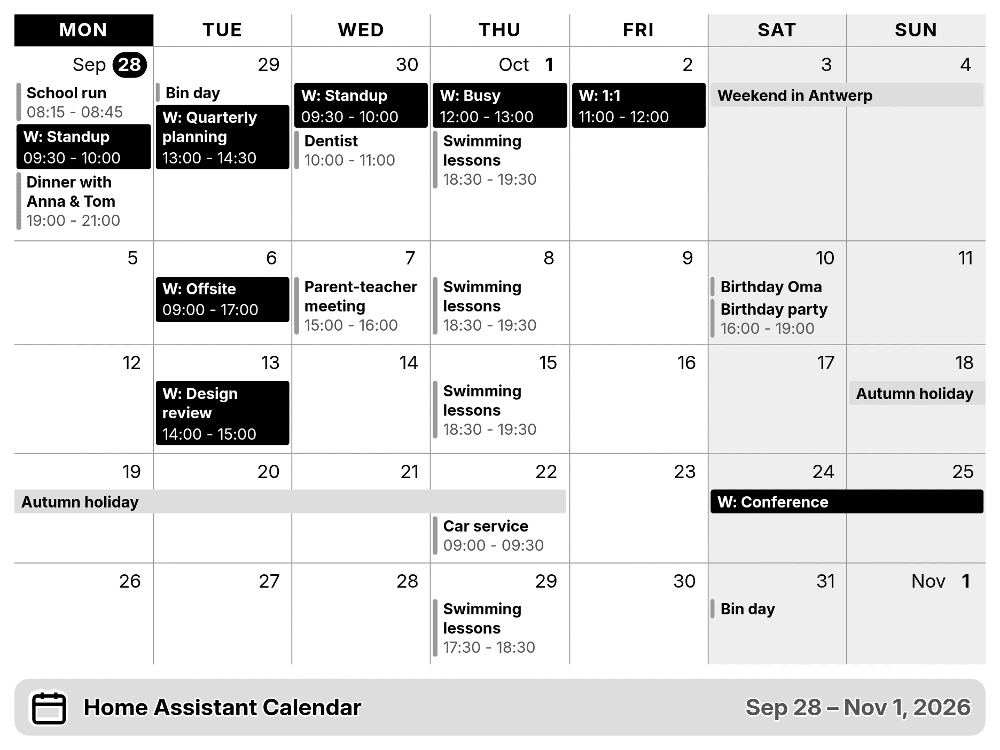
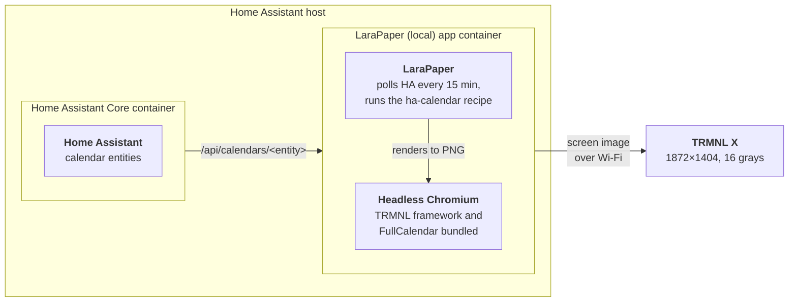
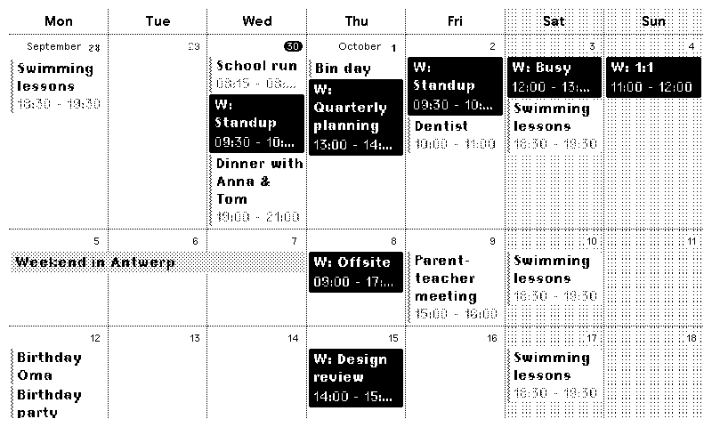

# trmnl-homeassistant-calendar

A rolling-month calendar for a **TRMNL X**, fed by **Home Assistant** calendar entities
and rendered by a self-hosted TRMNL server ([LaraPaper](https://github.com/usetrmnl/larapaper)).



## How it works



<sub>With Docker Compose instead of the app, the LaraPaper container runs on any machine that can reach Home Assistant.</sub>

## What's in this repository

- **The calendar recipe** (`plugin/src/`): a LaraPaper recipe that polls Home Assistant's
  calendar API and draws the events with FullCalendar inside the TRMNL framework. Each
  release has it as `ha-calendar.zip`, ready to import into LaraPaper.
- **LaraPaper (local)** (`larapaper/`, `repository.yaml`): a Home Assistant app that runs
  the official LaraPaper image with the TRMNL framework, its fonts and FullCalendar built
  in, so rendering a screen needs no internet access. See
  [larapaper/DOCS.md](larapaper/DOCS.md).
- **A local preview** (`preview/`): renders the recipe to a PNG at the device's
  resolution and grey levels, from sample, random or live Home Assistant data. CI uses it
  to check every change.

| Path | What |
|---|---|
| `plugin/src/settings.yml` | Recipe settings: polling URL, auth header, custom fields |
| `plugin/src/full.liquid` | Markup (fork of `_full_month.html.erb`) |
| `plugin/src/shared.liquid` | CSS + JS (fork of `_common.html.erb` + the HA event mapping) |
| `preview/` | Local renderer and CI render checks |
| `scripts/build-zip.sh` | Packages `plugin/src` for import into LaraPaper (attached to each release) |
| `larapaper/`, `repository.yaml` | The LaraPaper (local) Home Assistant app |
| `docker-compose.yml` | Plain LaraPaper, for running outside Home Assistant |

## Differences from upstream

The recipe is a fork of TRMNL's native calendar plugin
([usetrmnl/plugins `lib/calendars`](https://github.com/usetrmnl/plugins/tree/master/lib/calendars)),
`rolling_month` layout only. The FullCalendar view, the 4–6 week fitting and the event
filtering work as upstream. What changed:

- **Home Assistant instead of Google Calendar.** Events come from HA's
  `/api/calendars/<entity>` endpoint, so any HA calendar integration works. HA's JSON is
  turned into FullCalendar events in the browser, where upstream does it server-side.
- **Liquid recipe instead of ERB.** Runs on LaraPaper; the settings are custom fields.
- **Open-source parts only.** The public FullCalendar 6.1 build instead of TRMNL's
  private one, and styles rebuilt from TRMNL framework classes, because upstream's
  calendar stylesheets aren't published. The look matches upstream's month preview.
- **Per-calendar colors and prefixes** replace Google's calendar and event colors.
  The RSVP filter is gone, since HA doesn't expose attendees.
- **Explicit time zone handling**: events are converted to the configured zone, so the
  result doesn't depend on the renderer's system zone.
- **Rendering fixes and additions**: FullCalendar measures correctly under the
  framework's scale transform, a choice between adapted greys and full-screen dithering
  on 1-/2-bit screens, and a notice when a calendar fails to load.
- **Removed**: the time-grid helpers and FullCalendar's own header toolbar (the
  framework's title bar is used instead).

[UPSTREAM.md](UPSTREAM.md) maps each upstream file to its counterpart here and lists
the changes in detail.

## Setup

### 1. Run LaraPaper

**As a Home Assistant app (recommended).** This repository is an app repository. Go to
Settings → Apps → store → ⋮ → Repositories, add
`https://github.com/BartSchuurmans/trmnl-homeassistant-calendar`, and install
**LaraPaper (local)**. It bundles the TRMNL framework and FullCalendar, so rendering
needs no internet access. Setup steps are in [larapaper/DOCS.md](larapaper/DOCS.md). In
the recipe settings, use `http://homeassistant:8123` as the Home Assistant URL.

**Or with Docker Compose** on any machine:

```sh
cat > .env <<EOF
APP_KEY=base64:$(openssl rand -base64 32)
APP_URL=http://<server-ip>:4567
EOF
docker compose up -d
```

Open `http://<server-ip>:4567` and register. Set your time zone in your user
settings; the calendar uses it unless you set one on the plugin.

### 2. Point the TRMNL X at it

A new TRMNL X starts in Wi-Fi pairing mode. To get back to it on one that is already set
up, hold the left and right ends of the touch bar until the screen flashes (the X has no
button on the back). Connect to the **TRMNL** Wi-Fi network it opens, tap **Advanced** →
**Custom Server** → **Yes** and enter `http://<server-ip>:4567`, without a trailing
slash. Then go **Back to Wi-Fi**, pick your network and **Connect**.

With the **Auto-Join** toggle in LaraPaper's header switched on (it then reads **Auto-Join
Permitted**; only the first registered user sees it), the device shows up by itself.
Check that its device model is **TRMNL X**.

### 3. Create a Home Assistant token

HA → your profile → **Security** → **Long-lived access tokens** → Create. Find your
calendar entity IDs under Settings → Devices & services → Entities (filter on
`calendar.`). Any calendar integration works (Local Calendar, Google, CalDAV, iCloud…).

Check it from the LaraPaper host:

```sh
curl -H "Authorization: Bearer $TOKEN" \
  "http://homeassistant.local:8123/api/calendars/calendar.family?start=2026-09-21&end=2026-11-10"
```

### 4. Import the plugin

Download [`ha-calendar.zip`](https://github.com/BartSchuurmans/trmnl-homeassistant-calendar/releases/latest/download/ha-calendar.zip) from the latest
[release](https://github.com/BartSchuurmans/trmnl-homeassistant-calendar/releases), or
build it from a checkout:

```sh
./scripts/build-zip.sh        # → dist/ha-calendar.zip
```

LaraPaper → **Plugins** → add menu → **Import Recipe Archive** → upload `ha-calendar.zip`. Then
open the recipe's settings and fill in:

- **Home Assistant URL**, e.g. `http://homeassistant.local:8123` (must be reachable
  from the LaraPaper container)
- **Access token**
- **Calendar entities**, e.g. `calendar.family`, `calendar.work`

Add the recipe to the device's playlist (**Add to Playlist** on the recipe page).

**Updating:** import the ZIP from a newer release, or after changing anything under
`plugin/src`, rebuild and import it again. The recipe keeps the same `id` (`settings.yml`), so LaraPaper updates it in
place and keeps your settings.

## Settings

| Setting | Default | Notes |
|---|---|---|
| Calendar prefixes | – | Text shown before each event title, per calendar (e.g. `W:`) |
| Calendar colors | – | Event background per calendar: a TRMNL color name (`black`, `gray-10` … `gray-75`, `red`, `blue-40`, …) or a hex color |
| Time zone | LaraPaper user time zone | Events are converted to this zone before rendering |
| Week starts on | Monday | |
| Advance | Weekly | `Daily` starts the grid at today instead of the start of the week |
| Time format | 24 hour | |
| Show event times / end times | yes / yes | Times go on their own line below the title. End times only show with event times on |
| Show past events | yes | Earlier days of the current week |
| Highlight today | yes | |
| Shade weekends | yes | |
| Show title bar | no | The framework's title bar, with the recipe name and the visible date range |
| Show week numbers | no | |
| Greys on 1-bit / 2-bit screens | Adapt styles | `Adapt` uses the framework's greys, which become dither patterns on 1-/2-bit screens. `Dither` paints plain greys and has LaraPaper Floyd–Steinberg dither the whole screen. LaraPaper dithers 4-bit output (TRMNL X) either way, so this only matters for 1-bit and 2-bit devices |
| Locale | `en` | Day/month names, e.g. `nl`, `de` |
| Ignore events containing / titled exactly | – | Same filters as upstream |

The grid shows as many whole weeks (4–6) as fit, like upstream: busy weeks make
rows taller, so fewer fit. In a very busy month the 4th week can be cut off.

<sub>Greys on a 1-bit screen: <b>Adapt styles</b> (left) vs <b>Dither</b> (right).</sub><br>
 

### Multiple calendars

List several entities under **Calendar entities**. **Calendar prefixes** and
**Calendar colors** are matched to them by position: the first prefix/color goes with
the first entity, and so on. Empty entries are skipped, so use `-` to hold the place of
a calendar that should have none. For example, with these settings:

| Setting | Entries |
|---|---|
| Calendar entities | `calendar.family`, `calendar.work` |
| Calendar prefixes | `-`, `W:` |
| Calendar colors | `gray-65`, `black` |

family events get no prefix and a `gray-65` fill, and work events get `W:` and a
`black` fill.

- **Prefix**: shown before the title, followed by a space (`W: Standup`).
- **Color**: fills every event of that calendar, timed ones included, instead of a dot.
  Text turns black or white depending on how light the color is.
  - Color names use the framework's classes: solid greys on the TRMNL X (hues fall back
    to a grey), dither patterns with outlined text on 1-/2-bit screens, and real
    colors on color panels.
  - Hex colors are painted as-is. Without dithering, a 1-bit screen snaps them to black
    or white.
- Events without a calendar color use the upstream look: timed events get a grey bar
  on the left with the time in grey below the title, and all-day events a light grey
  bar.

## TRMNL framework

LaraPaper renders recipes inside the [TRMNL framework](https://github.com/usetrmnl/trmnl-framework)
(`framework_version: 3.3.1` in `settings.yml`, LaraPaper's default). The plugin uses it for:

- **Text**: `text--small` / `text--base` on FullCalendar's elements. That's Inter at the
  device's scale on the TRMNL X, and TRMNL pixel fonts on low-density 1-bit screens.
- **Greys**: `bg--gray-75` for weekends and `text--muted` for past days. Solid on 4-bit,
  dither patterns on 1-/2-bit.
- **Layout**: `view` → `layout` → optional `title_bar`, with spacing from `--ui-scale`.

The calendar grid itself (borders, cells, event blocks) is custom CSS, as upstream,
because the framework has no calendar component.

On the TRMNL X, LaraPaper renders at 1872×1404 with `screen--v2 screen--scale-xxlarge`.
The framework lays that out at 1040×780 and scales the screen by 1.8 with a CSS
`transform`, with a 1.5× UI scale on top. FullCalendar can't measure through a transform,
so `shared.liquid` corrects its measurements inside the calendar (see the comment there).

## Local preview

```sh
cd preview && npm install
node render.mjs                                   # sample events → out/preview.png
node render.mjs --set display_event_end=no --set locale=nl
node render.mjs --device og --set dither_greys=yes    # 1-bit, dithered greys
HA_URL=http://homeassistant.local:8123 HA_TOKEN=... \
  HA_CALENDARS=calendar.family,calendar.work node render.mjs   # your real calendars
```

Options: `--set key=value` (any custom field), `--tz Europe/Amsterdam`,
`--device og` / `og2` (800×480, 1-bit / 2-bit), `--raw` (skip the grey-level reduction), `--data payload.json`, `--out file.png`. It needs a Chromium;
set `CHROMIUM_PATH` if Playwright can't find one.

The preview uses the same window size, screen classes and framework version as
LaraPaper. It loads the framework from trmnl.com; to work offline, point
`FRAMEWORK_DIR` at the `public/` folder of a
[trmnl-framework](https://github.com/usetrmnl/trmnl-framework) checkout at the matching
tag (`git checkout v3.3.1`). Templates are rendered with [liquidjs](https://liquidjs.com)
instead of LaraPaper's PHP Liquid, so small differences are possible.

## CI

- **Render** (`.github/workflows/render.yml`, on changes to the recipe or preview): runs
  `preview/ci.sh`. That renders sample and random calendars on the TRMNL X and OG with
  the framework files pinned in `larapaper/assets.txt`, and renders once through
  LaraPaper's PHP Liquid engine (`preview/php/render.php`, which also checks the polling
  URLs and header). It fails on template errors, JavaScript errors and renders that
  don't finish. The screenshots are attached to the run as the `renders` artifact.
- **App** (`.github/workflows/app.yml`, on changes to `larapaper/` or the recipe): lints
  the app, builds the image (amd64) and starts it with a fake `/data`. It checks that
  LaraPaper comes up, serves the bundled framework, fonts and FullCalendar, applied the
  app options, and keeps its key and database across a restart.
- **End-to-end** (`e2e/run.mjs`, part of the App workflow): imports the recipe ZIP into
  that LaraPaper, points it at a fake Home Assistant (`e2e/fake-ha.mjs`) and fetches
  the screen like a TRMNL X does (`GET /api/display`). It checks the polled URLs and
  token, the stored payload for two, one and zero-event calendars, that the recipe
  rendered rather than LaraPaper's error screen, the PNG size, and that events show up
  on the screen. The screens are attached as the `e2e-screens` artifact.

To run the render checks locally, set up `FRAMEWORK_DIR` as in the workflow, run
`composer install` in `preview/php`, then run `sh preview/ci.sh`.

## Notes

- The polling URL uses Liquid that relies on PHP's `DateTime` (`"today -7 days" | date`),
  which LaraPaper's Liquid engine supports. It fetches 7 days back to 43 days ahead,
  enough for the current week plus 6 weeks.
- The recipe loads FullCalendar from `/ha-calendar/...`, which the LaraPaper (local)
  app serves, and falls back to jsDelivr on any other server. With plain LaraPaper,
  rendering also loads the TRMNL framework from trmnl.com, so the container needs
  internet access. The app avoids both. How: screens render from a temporary
  `file://` page, so root-relative paths resolve to files in the image, and to nginx
  in the browser preview.
- Like LaraPaper, the preview reduces the screenshot to the device's grey levels. 4-bit
  is always dithered. 1-bit and 2-bit are dithered only when the page contains
  ``, which is what the `Dither` setting adds.
- The token only goes into the request header. It is not written into the rendered page.

## License

MIT, see [LICENSE](LICENSE), for this project's own code. The recipe is forked from
TRMNL's source-available native calendar plugin, and the Home Assistant app bundles the
TRMNL framework, its fonts and FullCalendar; see
[THIRD_PARTY_NOTICES.md](THIRD_PARTY_NOTICES.md) for their terms.
